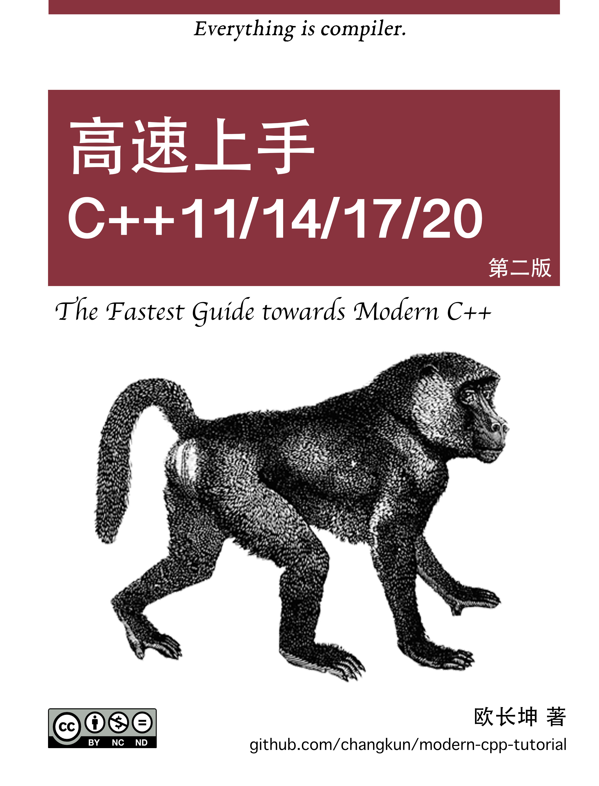

# 现代 C++ 教程：高速上手 C++11/14/17/20

 [](./README.md) [](./README-zh-cn.md) [](./assets/donate.md)

## 本书目的

本书号称『高速上手』，从内容上对二十一世纪二十年代之前产生 C++ 的相关特性做了非常相对全面的介绍，读者可以自行根据下面的目录选取感兴趣的内容进行学习，快速熟悉需要了解的内容。这些特性并不需要全部掌握，只需针对自己的使用需求和特定的应用场景，学习、查阅最适合自己的新特性即可。

同时，本书在介绍这些特性的过程中，尽可能简单明了的介绍了这些特性产生的历史背景和技术需求，这为理解这些特性、运用这些特性提供了很大的帮助。

此外，笔者希望读者在阅读本书后，能够努力在新项目中直接使用现代 C++，并努力将旧项目逐步迁移到现代 C++。也算是笔者为推进现代 C++ 的普及贡献了一些绵薄之力。

## 目标读者

1. 本书假定读者已经熟悉了传统 C++ ，至少在阅读传统 C++ 代码上不具备任何困难。换句话说，那些长期使用传统 C++进行编码的人、渴望在短时间内迅速了解**现代 C++** 特性的人非常适合阅读本书；
2. 本书一定程度上介绍了一些现代 C++ 的**黑魔法**，但这些魔法毕竟有限，不适合希望进阶学习现代 C++ 的读者，本书的定位系**现代 C++ 的快速上手**。当然，希望进阶学习的读者可以使用本书来回顾并检验自己对 **现代 C++** 的熟悉度。

## 开始阅读

你可以选择以下几种阅读方式：

1. [GitHub 在线](./book/zh-cn/toc.md)
2. [PDF 文档](https://changkun.de/modern-cpp/pdf/modern-cpp-tutorial-zh-cn.pdf)
3. [EPUB 文档](https://changkun.de/modern-cpp/epub/modern-cpp-tutorial-zh-cn.epub)
4. [网站](https://changkun.de/modern-cpp/)

## 相关代码

本书每章中都出现了大量的代码，如果你在跟随本书介绍特性的思路编写自己的代码遇到问题时，不妨读一读随书附上的源码，你可以在[这里](./code)中找到书中介绍过的全部的源码，所有代码按章节组织，文件夹名称为章节序号。

## 随书习题

本书每章最后还加入了少量难度极小的习题，仅用于检验你是否能混合运用当前章节中的知识点。你可以在[这里](./exercises)找到习题的答案，文件夹名称为章节序号。

## 本书网站

本书的[网站](https://changkun.de/modern-cpp)源码可以在[这里](./website)找到，由 [hexo](https://hexo.io) 和 [vuejs](https://vuejs.org) 协同构建而成。网站旨在提供一个除 GitHub 之外的阅读方式，除了在桌面端访问之外，你也可以在移动端上阅读本书。

## 构建

如果你希望在本地编译整个仓库，我们建议使用 [Docker](https://docs.docker.com/install/)。如果 Docker 在你的本地能正常使用，则可以简单的通过运行下面的指令完成构建：

```bash
$ make build
```

## 致谢

笔者时间和水平有限，如果读者发现书中内容的错误，欢迎提 [Issue](https://github.com/changkun/modern-cpp-tutorial/issues)，或者直接提 [Pull request](https://github.com/changkun/modern-cpp-tutorial/pulls)。详细贡献指南请参考[如何参与贡献](CONTRIBUTING.md)，由衷感谢每一位指出本书中出现错误的读者，包括但不限于 [Contributors](https://github.com/changkun/modern-cpp-tutorial/graphs/contributors)。

<p>本项目还由以下产品提供赞助支持：</p>
<p>
  <a href="https://www.digitalocean.com/?refcode=834a3bbc951b&utm_campaign=Referral_Invite&utm_medium=Referral_Program&utm_source=CopyPaste">
    
  </a>
</p>

## 许可

<a rel="license" href="http://creativecommons.org/licenses/by-nc-nd/4.0/"></a>

本书系[欧长坤](https://github.com/changkun)著，采用[知识共享署名-非商业性使用-禁止演绎 4.0 国际许可协议](http://creativecommons.org/licenses/by-nc-nd/4.0/)许可。项目中代码使用 MIT 协议开源，参见[许可](./LICENSE)。
