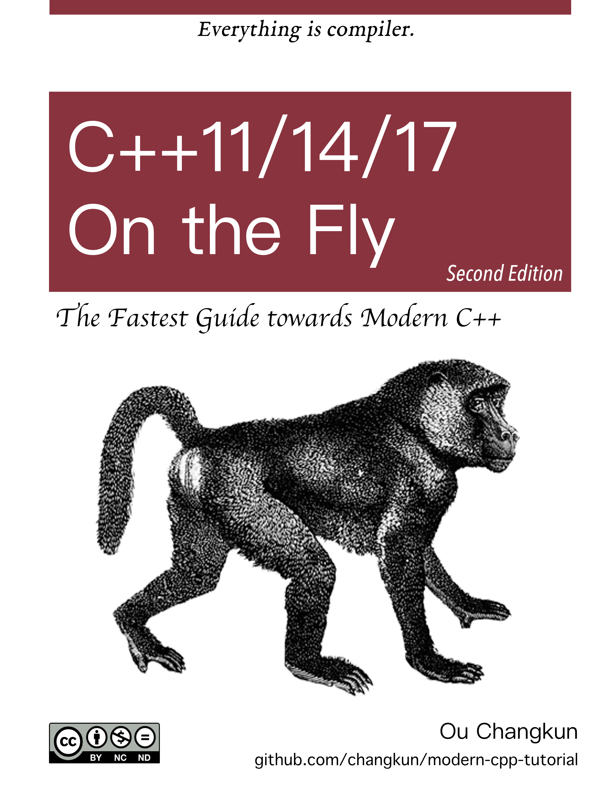

# Modern C++ Tutorial: C++11/14/17/20 On the Fly

 [](./README.md) [](./README-zh-cn.md) [](./assets/donate.md)
## Purpose

The book claims to be "On the Fly". Its intent is to provide a comprehensive introduction to the relevant features regarding modern C++ (before 2020s).
Readers can choose interesting content according to the following table of content to learn and quickly familiarize the new features you would like to learn.
Readers should be aware that not all of these features are required. Instead, it should be learned when you really need it.

At the same time, instead of coding-only, the book introduces the historical background of its technical requirements (as simple as possible), which provides great help in understanding why these features came out.

In addition, the author would like to encourage readers to use modern C++ directly in their new projects and  migrate their old projects to modern C++ gradually after reading the book.

## Targets

- This book assumes that readers are already familiar with traditional C++ (i.e. C++98 or earlier), or at least that they do not have any difficulty in reading traditional C++ code. In other words, those who have long experience in traditional C++ and people who desire to quickly understand the features of modern C++ in a short period of time are well suited to read the book.

- This book introduces, to a certain extent, the dark magic of modern C++. However, these magic tricks are very limited, they are not suitable for readers who want to learn advanced C++. The purpose of this book is offering a quick start for modern C++. Of course, advanced readers can also use this book to review and examine themselves on modern C++.

## Start

You can choose from the following reading methods:

- [GitHub Online](./book/en-us/toc.md)
- [PDF document](https://changkun.de/modern-cpp/pdf/modern-cpp-tutorial-en-us.pdf)
- [EPUB document](https://changkun.de/modern-cpp/epub/modern-cpp-tutorial-en-us.epub)
- [Website](https://changkun.de/modern-cpp)

## Code

Each chapter of this book contains a lot of code. If you encounter problems while writing your own code with the introductory features of the book, reading the source code attached to the book might be of help. You can find the book [here](./code). All the code is organized by chapter, the folder name is the chapter number.

## Exercises

There are few exercises at the end of each chapter of the book. These are meant to test whether you have mastered the knowledge in the current chapter. You can find the possible answer to the problem [here](./exercises). Again, the folder name is the chapter number.

## Website

The source code of the [website](https://changkun.de/modern-cpp) of this book can be found [here](./website), which is built by [hexo](https://hexo.io) and [vuejs](https://vuejs.org). The website provides you another way of reading the book, it also adapts to mobile browsers.

## Build

If you are interested in building everything locally, it is recommended using [Docker](https://docs.docker.com/install/). To build, simply run:

```bash
$ make build
```

## Acknowledgements

This book was originally written in Chinese by [Changkun Ou](https://changkun.de).

The author has limited time and language skills. If readers find any mistakes in the book or any language improvements, please feel free to open an [Issue](https://github.com/changkun/modern-cpp-tutorial/issues) or start a [Pull request](https://github.com/changkun/modern-cpp-tutorial/pulls). For detailed guidelines and checklist, please refer to [How to contribute](CONTRIBUTING.md).

The author is grateful to all contributors, including but not limited to [Contributors](https://github.com/changkun/modern-cpp-tutorial/graphs/contributors).

<p>This project is also supported by:</p>
<p>
  <a href="https://www.digitalocean.com/?refcode=834a3bbc951b&utm_campaign=Referral_Invite&utm_medium=Referral_Program&utm_source=CopyPaste">
    
  </a>
</p>

## Licenses

<a rel="license" href="http://creativecommons.org/licenses/by-nc-nd/4.0/"></a><br />This work was written by [Ou Changkun](https://changkun.de) and licensed under a <a rel="license" href="http://creativecommons.org/licenses/by-nc-nd/4.0/">Creative Commons Attribution-NonCommercial-NoDerivatives 4.0 International License</a>. The code of this repository is open sourced under the [MIT license](./LICENSE).
