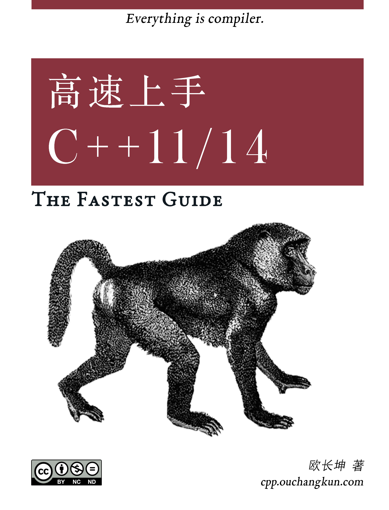

《高速上手 C++11/14》相关源码
====

**本仓库包含了《[高速上手 C++11/14](https://www.gitbook.com/book/changkun/cpp1x-tutorial/details)》中的相关代码。**

本书目的
-- 

本教程虽号称高速上手教程，但实际上对 C++11/14 的相关特性做了一个较为全面的介绍，读者可以自行根据下面的目录选取感兴趣的内容进行学习，快速熟悉需要了解的内容，这从某种意义上来说，也算是高速上手了。

这些特性并不需要全部掌握，只需针对特定的应用场景，学习、查阅最适合自己的新特性即可。

值得一提的是，本教程在介绍这些特性的过程中，尽可能简单明了的介绍了这些特性产生的历史背景和技术需求，这为理解这些特性、运用这些特性提供了很大的帮助。

目标读者
--

1. 本教程假定读者已经熟悉了传统 C++ ，至少在阅读传统 C++ 代码上不具备任何困难。换句话说，那些长期使用传统 C++进行编码的人、渴望在短时间内迅速了解 `Modern C++` 特性的人非常适合阅读本书；
2. 本教程一定程度上介绍了一些 C++1x 的**黑魔法**，但这些魔法毕竟有限，不适合希望进阶学习 C++1x 的读者，本教程的定位系**C++1x 的快速上手**。当然，希望进阶学习的读者可以使用本书来回顾并检验自己对 `Modern C++` 的熟悉度。

目录
--
- **第一章 C++11/14 简介**
    + 概述
    + 被弃用的特性
    + 与 C 的兼容性
- **第二章 语言可用性的强化**
    + `nullptr` 与 `constexpr`
    + 类型推导
        + `auto`
        + `decltype`
        + 尾返回类型、`auto` 与 `decltype` 配合

        <!--+ decltype(auto) (C++14)-->

    + 区间迭代
        + 基于范围的 for 循环
    + 初始化列表
        + `std::initializer_list`
        + 统一初始化语法
    + 模板增强
        + 外部模板
        + 尖括号 `>` 
        + 类型别名模板
        + 变长参数模板
    + 面向对象增强
        + 委托构造
        + 继承构造
        + 显式虚函数重载
            + `override`
            + `final`
        + 显式禁用默认函数
    + 强类型枚举
- **第三章 语言运行期的强化**
    + lambda 表达式
        + lambda 表达式基础
            + 值捕获
            + 引用捕获
            + 隐式捕获
            + 表达式捕获
        + 泛型 lambda
    + 函数对象包装器
        + std::function
        + std::bind/std::placeholder
    + 右值引用
        + 左值、右值的纯右值、将亡值、右值
        + 右值引用和左值引用
        + 移动语义
        + 完美转发
- **第四章 对标准库的扩充: 新增容器**
    + `std::array`
    + `std::forward_list`
    + `std::unordered_set`
    + `std::unordered_map`
    + `std::tuple`
        + 基本操作
        + 运行期索引
        + 合并与迭代
- **第五章 对标准库的扩充: 智能指针和引用计数**
    + RAII 与引用计数
    + `std::shared_ptr`
    + `std::unique_ptr`
    + `std::weak_ptr`
- **第六章 对标准库的扩充: 正则表达式库**
    + 正则表达式简介
        + 普通字符
        + 特殊字符
        + 限定符
    + `std::regex` 及其相关
        + `std::regex`
        + `std::regex_match`
        + `std::match_results`
- **第七章 对标准库的扩充: 语言级线程支持**
    + `std::thread`
    + `std::mutex`
    + `std::unique_lock`
    + `std::future`
    + `std::packaged_task`
    + `std::condition_variable`
- **第八章 其他杂项**
    + 新类型
        + `long long int`
    + `noexcept` 的修饰和操作
    + 字面量
        + 原始字符串字面量
        + 自定义字面量
- **第九章 扩展主题: C++17 简介**
    + 主要入选特性
        + 非类型模板参数的 `auto` 
        + `std::variant<>`
        + 结构化绑定(Structured bindings)
        + 变量声明的强化
    + 未入选特性
        + Concepts

## 交流

1. 本教程在每节的最下方提供了评论，如果读者发现教程中内容的错误，可以使用评论或者 issue 
来指出；
2. 本书依然有很多特性没有参与介绍，例如 `alignas` 内存对齐、无限制联合等，主要是考虑到这些特性的使用频次实在是太低，故没有多做介绍，若对未提及的特性有需求，笔者可以考虑将其加入`第八章`；
3. 本教程有以下交流群，有兴趣的读者可以加入，加群请注明 `github`：

## 许可

本项目中代码使用 MIT 协议开源，参见[许可](./LICENSE)。
