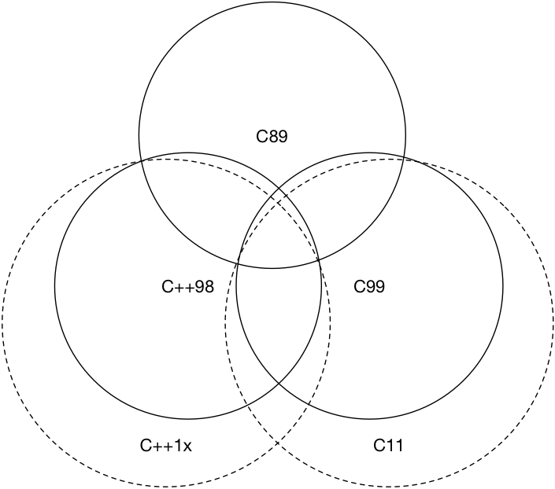

# Chapter 01: Towards Modern C++

[TOC]

**Compilation Environment**: This book will use `clang++` as the only compiler used,
and always use the `-std=c++2a` compilation flag in your code.

```bash
> clang++ -v
Apple LLVM version 10.0.1 (clang-1001.0.46.4)
Target: x86_64-apple-darwin18.6.0
Thread model: posix
InstalledDir: /Library/Developer/CommandLineTools/usr/bin
```

## 1.1 Deprecated Features

Before learning modern C++, let's take a look at the main features that have deprecated since C++11:

> **Note**: Deprecation is not completely unusable, it is only intended to imply that features will disappear from future standards and should be avoided. But, the deprecated features are still part of the standard library, and most of the features are actually "permanently" reserved for compatibility reasons.

- **The string literal constant is no longer allowed to be assigned to a `char *`. If you need to assign and initialize a `char *` with a string literal constant, you should use `const char *` or `auto`.**

  ```cpp
  char *str = "hello world!"; // A deprecation warning will appear
  ```

- **C++98 exception description, `unexpected_handler`, `set_unexpected()` and other related features are deprecated and should use `noexcept`.**

- **`auto_ptr` is deprecated and `unique_ptr` should be used.**

- **`register` keyword is deprecated and can be used but no longer has any practical meaning.**

- **The `++` operation of the `bool` type is deprecated.**

- **If a class has a destructor, the properties for which it generates copy constructors and copy assignment operators are deprecated.**

- **C language style type conversion is deprecated (ie using `(convert_type)`) before variables, and `static_cast`, `reinterpret_cast`, `const_cast` should be used for type conversion.**

- **In particular, some of the C standard libraries that can be used are deprecated in the latest C++17 standard, such as `<ccomplex>`, `<cstdalign>`, `<cstdbool>` and `<ctgmath>` Wait**

- ... and many more

There are also other features such as parameter binding (C++11 provides `std::bind` and `std::function`), `export` etc. are also deprecated. These features mentioned above **If you have never used or heard of it, please don't try to understand them. You should move closer to the new standard and learn new features directly**. After all, technology is moving forward.

## 1.2 Compatibilities with C

For some force majeure and historical reasons, we had to use some C code (even old C code) in C++, for example, Linux system calls. Before the advent of modern C++, most people talked about "what is the difference between C and C++". Generally speaking, in addition to answering the object-oriented class features and the template features of generic programming, there is no other opinion or even a direct answer. "Almost" is also a lot of people. The Venn diagram in Figure 1.2 roughly answers the C and C++ related compatibility.



From now on, you should have the idea that "C++ is **not** a superset of C" in your mind (and not from the beginning, later [References for further reading](#further-readings) The difference between C++98 and C99 is given). When writing C++, you should also avoid using program styles such as `void*` whenever possible. When you have to use C, you should pay attention to the use of `extern "C"`, separate the C language code from the C++ code, and then unify the link, for instance:

```cpp
// foo.h
#ifdef __cplusplus
extern "C" {
#endif

int add(int x, int y);

#ifdef __cplusplus
}
#endif

// foo.c
int add(int x, int y) {
    return x+y;
}

// 1.1.cpp
#include "foo.h"
#include <iostream>
#include <functional>

int main() {
    [out = std::ref(std::cout << "Result from C code: " << add(1, 2))](){
        out.get() << ".\n";
    }();
    return 0;
}
```

You should first compile the C code with `gcc`:

```bash
gcc -c foo.c
```

Compile and output the `foo.o` file, and link the C++ code to the `.o` file using `clang++` (or both compile to `.o` and then link them together):

```bash
clang++ 1.1.cpp foo.o -std=c++2a -o 1.1
```

Of course, you can use `Makefile` to compile the above code:

```makefile
C = gcc
CXX = clang++

SOURCE_C = foo.c
OBJECTS_C = foo.o

SOURCE_CXX = 1.1.cpp

TARGET = 1.1
LDFLAGS_COMMON = -std=c++2a

all:
	$(C) -c $(SOURCE_C)
	$(CXX) $(SOURCE_CXX) $(OBJECTS_C) $(LDFLAGS_COMMON) -o $(TARGET)

clean:
	rm -rf *.o $(TARGET)
```

> **Note**: Indentation in `Makefile` is a tab instead of a space character. If you copy this code directly into your editor, the tab may be automatically replaced. Please ensure the indentation in the `Makefile` is done by tabs.
>
> If you don't know the use of `Makefile`, it doesn't matter. In this tutorial, you won't build code that is written too complicated. You can also read this book by simply using `clang++ -std=c++2a` on the command line.

If you are new to modern C++, you probably still don't understand the following small piece of code above, namely:

```cpp
[out = std::ref(std::cout << "Result from C code: " << add(1, 2))](){
    out.get() << ".\n";
}();
```

Don't worry at the moment, we will come to meet them in our later chapters.

[Table of Content](./toc.md) | [Previous Chapter](./00-preface.md) | [Next Chapter: Language Usability Enhancements](./02-usability.md)

## Further Readings

- [A Tour of C++ (2nd Edition) Bjarne Stroustrup](https://www.amazon.com/dp/0134997832/ref=cm_sw_em_r_mt_dp_U_GogjDbHE2H53B)
  [History of C++](http://en.cppreference.com/w/cpp/language/history)
- [C++ compiler support](https://en.cppreference.com/w/cpp/compiler_support)
- [Incompatibilities Between ISO C and ISO C++](http://david.tribble.com/text/cdiffs.htm#C99-vs-CPP98)

## Licenses

<a rel="license" href="http://creativecommons.org/licenses/by-nc-nd/4.0/"></a><br />This work was written by [Ou Changkun](https://changkun.de) and licensed under a <a rel="license" href="http://creativecommons.org/licenses/by-nc-nd/4.0/">Creative Commons Attribution-NonCommercial-NoDerivatives 4.0 International License</a>. The code of this repository is open sourced under the [MIT license](../../LICENSE).
