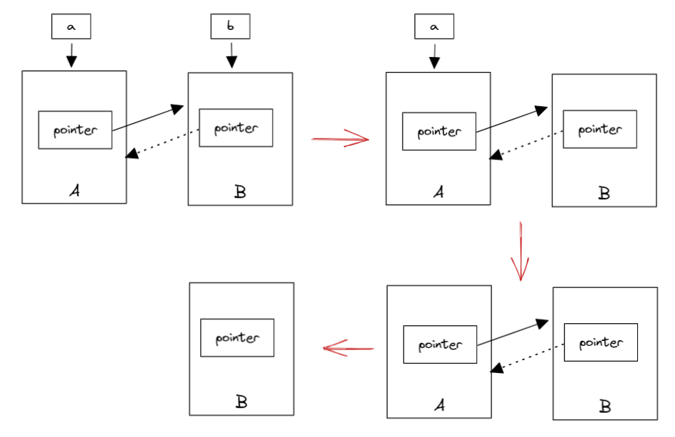

# Chapter 05 Smart Pointers and Memory Management

[TOC]

## 5.1 RAII and Reference Counting

Programmers who understand `Objective-C`/`Swift`/`JavaScript` should know the concept of reference counting. The reference count is counted to prevent memory leaks.
The basic idea is to count the number of dynamically allocated objects. Whenever you add a reference to the same object, the reference count of the referenced object is incremented once.
Each time a reference is deleted, the reference count is decremented by one. When the reference count of an object is reduced to zero, the pointed heap memory is automatically deleted.

In traditional C++, "remembering" to manually release resources is not always a best practice. Because we are likely to forget to release resources and lead to leakage.
So the usual practice is that for an object, we apply for space when constructor, and free space when the destructor (called when leaving the scope).
That is, we often say that the RAII resource acquisition is the initialization technology.

There are exceptions to everything, we always need to allocate objects on free storage. In traditional C++ we have to use `new` and `delete` to "remember" to release resources. C++11 introduces the concept of smart pointers, using the idea of ​​reference counting so that programmers no longer need to care about manually releasing memory.
These smart pointers include `std::shared_ptr`/`std::unique_ptr`/`std::weak_ptr`, which need to include the header file `<memory>`.

> Note: The reference count is not garbage collection. The reference count can recover the objects that are no longer used as soon as possible, and will not cause long waits during the recycling process.
> More clearly and indicate the life cycle of resources.

## 5.2 `std::shared_ptr`

`std::shared_ptr` is a smart pointer that records how many `shared_ptr` points to an object, eliminating to call `delete`, which automatically deletes the object when the reference count becomes zero.

But not enough, because using `std::shared_ptr` still needs to be called with `new`, which makes the code a certain degree of asymmetry.

`std::make_shared` can be used to eliminate the explicit use of `new`, so `std::make_shared` will allocate the objects in the generated parameters.
And return the `std::shared_ptr` pointer of this object type. For example:

```cpp
#include <iostream>
#include <memory>
void foo(std::shared_ptr<int> i) {
    (*i)++;
}
int main() {
    // auto pointer = new int(10); // illegal, no direct assignment
    // Constructed a std::shared_ptr
    auto pointer = std::make_shared<int>(10);
    foo(pointer);
    std::cout << *pointer << std::endl; // 11
    // The shared_ptr will be destructed before leaving the scope
    return 0;
}
```

`std::shared_ptr` can get the raw pointer through the `get()` method and reduce the reference count by `reset()`.
And see the reference count of an object by `use_count()`. E.g:

```cpp
auto pointer = std::make_shared<int>(10);
auto pointer2 = pointer; // reference count+1
auto pointer3 = pointer; // reference count+1
int *p = pointer.get(); // no increase of reference count
std::cout << "pointer.use_count() = " << pointer.use_count() << std::endl; // 3
std::cout << "pointer2.use_count() = " << pointer2.use_count() << std::endl; // 3
std::cout << "pointer3.use_count() = " << pointer3.use_count() << std::endl; // 3

pointer2.reset();
std::cout << "reset pointer2:" << std::endl;
std::cout << "pointer.use_count() = " << pointer.use_count() << std::endl; // 2
std::cout << "pointer2.use_count() = " << pointer2.use_count() << std::endl; // 0, pointer2 has reset
std::cout << "pointer3.use_count() = " << pointer3.use_count() << std::endl; // 2
pointer3.reset();
std::cout << "reset pointer3:" << std::endl;
std::cout << "pointer.use_count() = " << pointer.use_count() << std::endl; // 1
std::cout << "pointer2.use_count() = " << pointer2.use_count() << std::endl; // 0
std::cout << "pointer3.use_count() = " << pointer3.use_count() << std::endl; // 0, pointer3 has reset
```

## 5.3 `std::unique_ptr`

`std::unique_ptr` is an exclusive smart pointer that prohibits other smart pointers from sharing the same object, thus keeping the code safe:

```cpp
std::unique_ptr<int> pointer = std::make_unique<int>(10); // make_unique was introduced in C++14
std::unique_ptr<int> pointer2 = pointer; // illegal
```

> `make_unique` is not complicated. C++11 does not provide `std::make_unique`, which can be implemented by itself:
>
> ```cpp
> template<typename T, typename ...Args>
> std::unique_ptr<T> make_unique( Args&& ...args ) {
>   return std::unique_ptr<T>( new T( std::forward<Args>(args)... ) );
> }
> ```
>
> As for why it wasn't provided, Herb Sutter, chairman of the C++ Standards Committee, mentioned in his [blog](https://herbsutter.com/gotw/_102/) that it was because they were forgotten.

Since it is monopolized, in other words, it cannot be copied. However, we can use `std::move` to transfer it to other `unique_ptr`, for example:

```cpp
#include <iostream>
#include <memory>

struct Foo {
    Foo()      { std::cout << "Foo::Foo" << std::endl;  }
    ~Foo()     { std::cout << "Foo::~Foo" << std::endl; }
    void foo() { std::cout << "Foo::foo" << std::endl;  }
};

void f(const Foo &) {
    std::cout << "f(const Foo&)" << std::endl;
}

int main() {
    std::unique_ptr<Foo> p1(std::make_unique<Foo>());

    // p1 is not empty, prints
    if (p1) p1->foo();
    {
        std::unique_ptr<Foo> p2(std::move(p1));

        // p2 is not empty, prints
        f(*p2);

        // p2 is not empty, prints
        if(p2) p2->foo();

        // p1 is empty, no prints
        if(p1) p1->foo();

        p1 = std::move(p2);

        // p2 is empty, no prints
        if(p2) p2->foo();
        std::cout << "p2 was destroyed" << std::endl;
    }
    // p1 is not empty, prints
    if (p1) p1->foo();

    // Foo instance will be destroyed when leaving the scope
}
```

## 5.4 `std::weak_ptr`

If you think about `std::shared_ptr` carefully, you will still find that there is still a problem that resources cannot be released. Look at the following example:

```cpp
#include <iostream>
#include <memory>

class A;
class B;

class A {
public:
    std::shared_ptr<B> pointer;
    ~A() {
        std::cout << "A was destroyed" << std::endl;
    }
};
class B {
public:
    std::shared_ptr<A> pointer;
    ~B() {
        std::cout << "B was destroyed" << std::endl;
    }
};
int main() {
    std::shared_ptr<A> a = std::make_shared<A>();
    std::shared_ptr<B> b = std::make_shared<B>();
    a->pointer = b;
    b->pointer = a;

    return 0;
}
```

The result is that A and B will not be destroyed. This is because the pointer inside a, b also references `a, b`, which makes the reference count of `a, b` becomes 2, leaving the scope. When the `a, b` smart pointer is destructed, it can only cause the reference count of this area to be decremented by one. This causes the memory area reference count pointed to by the `a, b` object to be non-zero, but the external has no way to find this area, it also caused a memory leak, as shown in Figure 5.1:


The solution to this problem is to use the weak reference pointer `std::weak_ptr`, which is a weak reference (compared to `std::shared_ptr` is a strong reference). A weak reference does not cause an increase in the reference count. When a weak reference is used, the final release process is shown in Figure 5.2:



In the above figure, only B is left in the last step, and B does not have any smart pointers to reference it, so this memory resource will also be released.

`std::weak_ptr` has no `*` operator and `->` operator, so it can't operate on resources. Its only function is to check if `std::shared_ptr` exists, its `expired()` method can return `false` when the resource is not released, otherwise, it returns `true`.

## Conclusion

The technology of smart pointers is not novel. It is a common technology in many languages. Modern C++ introduces this technology, which eliminates the abuse of `new`/`delete` to a certain extent. It is a more mature technology. Programming paradigm.

[Table of Content](./toc.md) | [Previous Chapter](./04-containers.md) | [Next Chapter: Regular Expression](./06-regex.md)

## Further Readings

- [Why does C++11 have `make_shared` but not `make_unique`](http://stackoverflow.com/questions/12580432/why-does-c11-have-make-shared-but-not-make-unique)

## Licenses

<a rel="license" href="http://creativecommons.org/licenses/by-nc-nd/4.0/"></a><br />This work was written by [Ou Changkun](https://changkun.de) and licensed under a <a rel="license" href="http://creativecommons.org/licenses/by-nc-nd/4.0/">Creative Commons Attribution-NonCommercial-NoDerivatives 4.0 International License</a>. The code of this repository is open sourced under the [MIT license](../../LICENSE).
